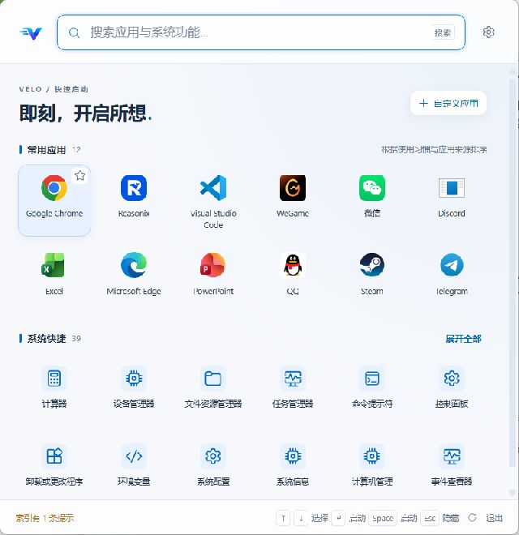
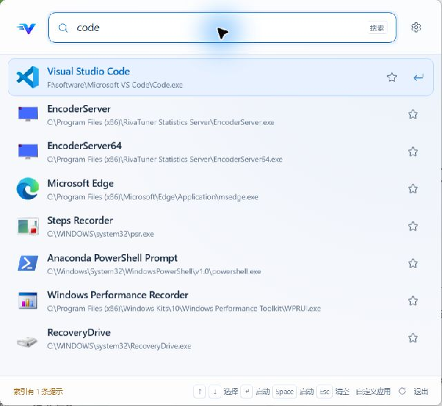
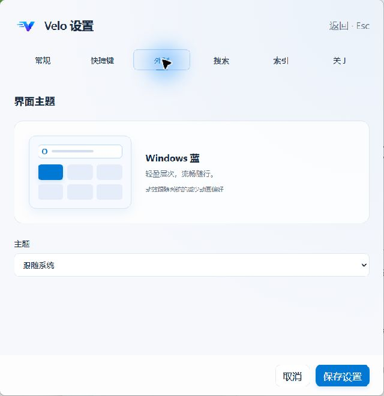

<p align="center">
  
</p>

<h1 align="center">Velo</h1>
<p align="center"><strong>Fast. Light. Ready.</strong><br />Press a shortcut. Find your app. Launch.</p>
<p align="center"><a href="README.md">简体中文</a> · <strong>English</strong></p>
<p align="center">
  <a href="https://github.com/HBLADEH/velo-launcher/actions/workflows/ci.yml"></a>
  <a href="LICENSE"></a>
  
</p>
<p align="center">
  <a href="https://github.com/HBLADEH/velo-launcher/releases">Download</a> ·
  <a href="#quick-start">Quick start</a> ·
  <a href="docs/user-guide.md">User guide (中文)</a> ·
  <a href="CONTRIBUTING.md">Contribute</a> ·
  <a href="https://github.com/HBLADEH/velo-launcher/issues">Report an issue</a>
</p>

Velo is a local application launcher for **Windows 10 / 11 x64**, built with Go, Wails 2, Vue 3, and TypeScript. Open it with a global keyboard shortcut to search applications and access common Windows tools.

> **0.9.7 is a preview release.** Release binaries are currently unsigned, and performance and long-term stability validation is ongoing. Only Windows is supported. The application UI is currently in Simplified Chinese; this page is an English translation of the primary Chinese README.

## Screenshots

Actual Velo 0.9.3 screenshots on Windows, showing the Chinese UI. Application lists vary with installed software and local usage history.

<p align="center">
  
</p>
<p align="center"><em>Home: quick access to frequently used apps and Windows tools.</em></p>

| Application search | Appearance settings |
| --- | --- |
|  |  |
| Enter a query, select a result, and launch. | Light, dark, and system themes are available. |

## Features

- **Keyboard controls**: open with a global shortcut, navigate with arrow keys, and launch with Enter. Supports hiding on focus loss and running in the system tray.
- **Window and session**: drag the top logo, title, or empty header area to move the launcher. Hiding preserves the current page, unsaved settings, and update progress; the window keeps its chosen position during the current session.
- **Application search**: exact, prefix, substring, and fuzzy matching with single-character typo tolerance. Ranking considers launch frequency, recent use, and query history.
- **Automatic indexing**: discovers apps in the Start menu, desktop, Windows Apps, and Program Files, with additional scan directories supported. Duplicate entries are merged; uninstallers, help tools, and updaters are hidden by default.
- **Quick access**: pinned apps, frequently used apps, and Windows shortcuts on the home screen. System shortcuts support Chinese, English, pinyin, and abbreviation searches.
- **Result actions**: right-click to launch, open the installation directory, run as administrator, or pin to the home screen.
- **System actions**: empty the Recycle Bin, shut down, restart, or lock Windows. Emptying the Recycle Bin, shutdown, and restart require confirmation.
- **Custom applications**: drag files in, select files, or paste paths to add `.exe` / `.lnk` entries outside scan directories. Custom entries and home-screen pins are managed independently.
- **Appearance and preferences**: light, dark, and system themes; switch between a list and an icon grid, with configurable shortcut, launch at sign-in, result count, and search weights.
- **Local storage**: settings, index, and launch history stay on your computer. Index and icon caching are enabled, with a background refresh every 30 minutes by default.
- **Configuration backups**: Settings → 备份 saves a separate JSON copy of your saved settings and lets you open the backup directory.
- **Updates**: checks GitHub Releases, verifies downloads with SHA-256, backs up settings before installation, and preserves existing preferences. Supports replacing standalone binaries or upgrading installed copies.

## Download and installation

Choose a Windows x64 asset from [Releases](https://github.com/HBLADEH/velo-launcher/releases):

| Distribution | File | Instructions |
| --- | --- | --- |
| Installer | `*-installer.exe` | Run the installation wizard |
| Standalone | `velo-launcher.exe` | Place it in a permanent directory and run it |

Both distributions store settings and caches in `%LOCALAPPDATA%\Velo`, rather than alongside the executable. Choose a permanent location before enabling launch at sign-in.

[Microsoft Edge WebView2 Runtime](https://developer.microsoft.com/microsoft-edge/webview2/) is required. Install it first if it is missing. macOS and Linux are not supported.

## Quick start

1. Start Velo and wait for the initial index to finish. Subsequent starts use the existing cache first.
2. Press `Alt+Space` and enter an application name, such as `code`.
3. Select a result with `↑` / `↓`, then press `Enter`. Use the star button to pin an app to the home screen.
4. Press `Ctrl+,` to configure the shortcut, theme, and scan directories.

Under **Settings → 快捷键** (Keyboard shortcut), click the recorder and press your key combination. Click **保存设置** (Save settings) to apply it; `Esc` cancels recording.

Enable **全屏时禁止快捷键呼出** to suppress the shortcut while the foreground application is fullscreen; the tray remains available. Opening the home screen immediately focuses search. Names, keywords, and aliases support substring matching.

| Action | Shortcut or location |
| --- | --- |
| Show / hide the launcher | `Alt+Space` (configurable) |
| Select previous / next result | `↑` / `↓` |
| Launch the selected app | `Enter`; `Space` is also enabled by default |
| Clear the query; hide if already empty | `Esc` |
| Open settings | `Ctrl+,` or the gear button |
| Add custom apps | Home → 自定义应用, or Settings → 索引 |
| Refresh the index | Footer refresh button, or Settings → 索引 |
| Back up settings | Settings → 备份 → 立即备份 |
| Check for updates | Settings → 关于 |
| Quit completely | Footer 退出 button, or the tray context menu |

Space launches the selected app by default. To enter queries containing spaces, such as `visual studio`, turn off **按空格键启动选中应用** under **Settings → 常规** (General).

To keep your current settings, click **立即备份** under **Settings → 备份** (Backup). **打开备份目录** opens `%LOCALAPPDATA%\Velo\backups`. Automatic updates also back up settings before installation and stop if the backup fails. Upgrades preserve existing settings; new options receive defaults when loaded. Unsaved edits, custom apps, pins, and history are not included in the settings backup.

The [user guide (Chinese)](docs/user-guide.md) covers custom apps, pinning, updates, storage, and troubleshooting. Updates can be disabled under **Settings → 关于** (About). Downloads are checked against the release's `SHA256SUMS.txt`; automatic installation stops if verification is unavailable or fails. Upgrading a copy installed in Program Files may require UAC confirmation.

## Development and builds

Use the CI environment as a reference: **Windows x64, Go 1.25.6, Node.js 22.15.0, npm 10, Wails CLI 2.12.0**, and WebView2 Runtime.

```powershell
git clone https://github.com/HBLADEH/velo-launcher.git
cd velo-launcher
go install github.com/wailsapp/wails/v2/cmd/wails@v2.12.0
wails doctor
npm --prefix frontend ci
wails dev
```

Validate and build:

```powershell
# Formatting, frontend checks/build, go vet, Go tests, and Windows packaging
./scripts/verify.ps1

# Validate without producing a Windows executable
./scripts/verify.ps1 -SkipBuild

# Also create an installer (requires NSIS and makensis on PATH)
./scripts/verify.ps1 -Installer
```

Artifacts are written to `build/bin/`. GitHub Actions uses the same validation script. Files in `frontend/wailsjs/` are generated by Wails; do not edit them manually.

```text
frontend/src/   Vue UI, styles, and assets
internal/       Search, indexing, configuration, history, and Windows integration
build/          Icons, Windows metadata, and installer configuration
scripts/        Validation and resource measurement scripts
docs/           User guide, developer notes, and validation records
```

## Documentation

The following detailed documents are currently in Chinese:

| Document | Contents |
| --- | --- |
| [User guide](docs/user-guide.md) | Custom apps, updates, troubleshooting, and storage |
| [Development guide](docs/development.md) | Debug flags, tests, releases, and resource measurements |
| [System shortcuts](docs/system-shortcuts.md) | Available entries and Windows compatibility |
| [Build assets](build/README.md) | Logo, application icons, and installer assets |
| [Verification records](docs/verification.md) | Completed checks, measurements, and limitations |
| [Implementation checklist](docs/implementation.md) | Feature progress and pending validation |

## Project status

Velo focuses on local Windows application search and launch. Plugins and cloud synchronization are not currently available. Core features are implemented; full performance and stability acceptance testing is still in progress.

Previous measurements showed approximately **154–218 MB of private memory**, including WebView2 child processes. The 80 MB design target has not been reached. These are environment-specific measurements, not a guarantee for every device. See the [verification records](docs/verification.md).

## Contributing

Bug reports, feature requests, documentation improvements, and pull requests are welcome. Read the bilingual [contribution guide](CONTRIBUTING.md) for the development and validation workflow.

When opening an [issue](https://github.com/HBLADEH/velo-launcher/issues), include your Windows version, Velo version, reproduction steps, and expected and actual behavior. Remove personal paths and other sensitive information from logs and screenshots before sharing.

## License and acknowledgments

Velo is licensed under the [MIT License](LICENSE).

The interface uses a locally bundled SVG subset of [Microsoft Fluent UI System Icons](https://github.com/microsoft/fluentui-system-icons) (MIT). Third-party applications retain their native icons. See the [icon license](frontend/src/assets/fluent/LICENSE.txt) and [integration notes (Chinese)](frontend/src/assets/fluent/README.md). Third-party notices are also available in the application's **Settings → 关于** (About) page.
